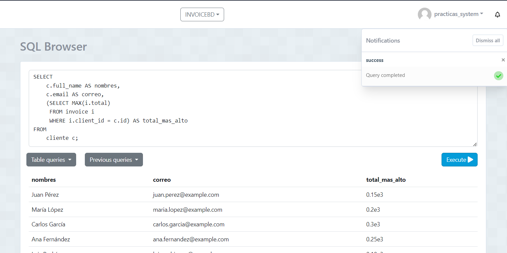
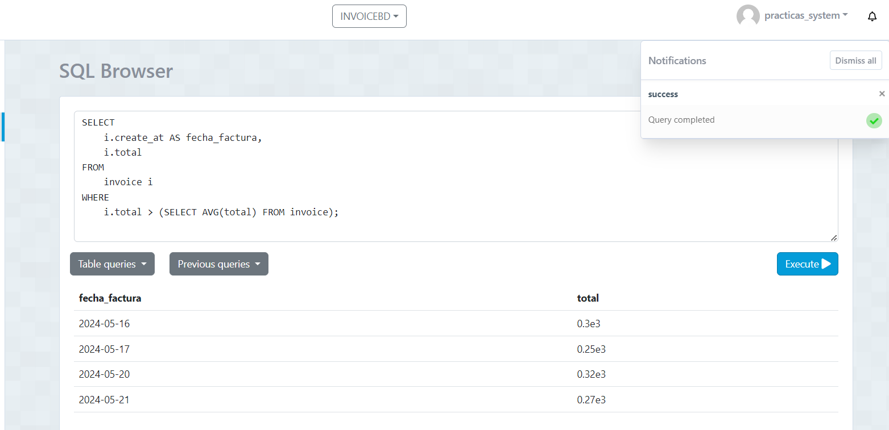
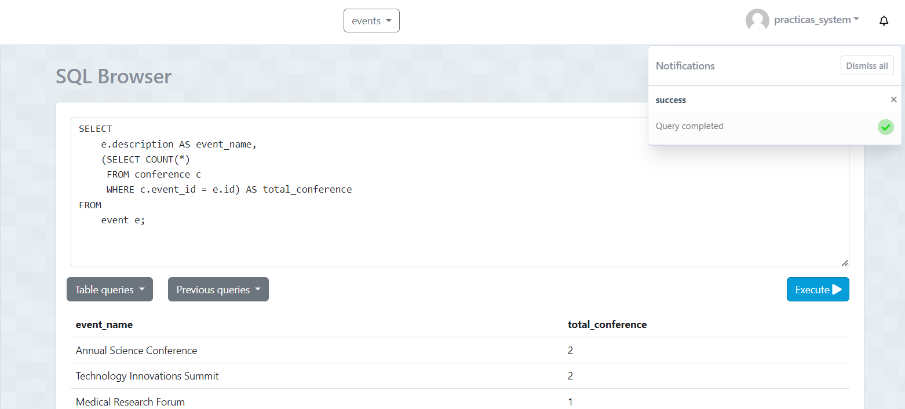
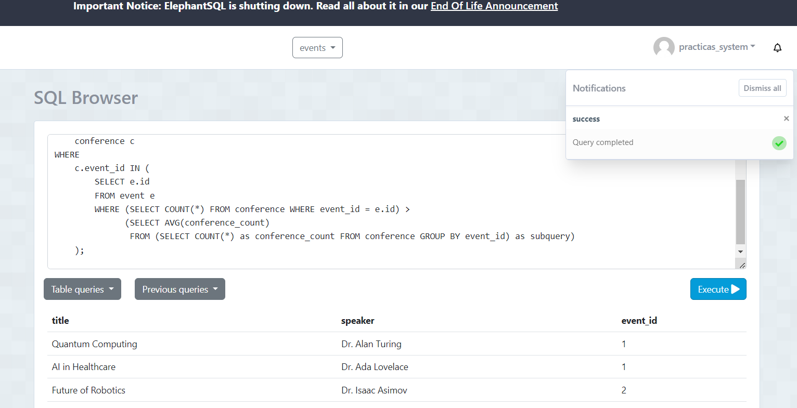

### DB INVOICE

#### El número total de facturas realizadas por cada cliente.
```sql
SELECT 
    c.full_name AS nombre_cliente,
    c.address AS direccion,
    (SELECT COUNT(*) 
     FROM invoice i 
     WHERE i.client_id = c.id) AS nro_facturas
FROM 
    cliente c;
```


### Listar nombre y correo de los clientes junto a su compra mas cara realizada.


```sql
SELECT 
    c.full_name AS nombres,
    c.email AS correo,
    (SELECT MAX(i.total) 
     FROM invoice i 
     WHERE i.client_id = c.id) AS total_mas_alto
FROM 
    cliente c;
```



### Listar las facturas donde sus totales sean mayores al promedio de las facturas
```sql
SELECT 
    i.create_at AS fecha_factura,
    i.total
FROM 
    invoice i
WHERE 
    i.total > (SELECT AVG(total) FROM invoice);

```


### DB EVENT
### Subconsulta en SELECT

Obtener el nombre de los eventos y el número total de conferencias en cada evento.

```sql
SELECT 
    e.description AS event_name,
    (SELECT COUNT(*) 
     FROM conference c 
     WHERE c.event_id = e.id) AS total_conference
FROM 
    event e;
```



### Subconsulta en WHERE


 Listar las conferencias de un evento específico cuyo event_id coincide con algún criterio.
```sql
SELECT 
    c.title,
    c.speaker,
    c.event_id
FROM 
    conference c
WHERE 
    c.event_id IN (
        SELECT e.id
        FROM event e
        WHERE (SELECT COUNT(*) FROM conference WHERE event_id = e.id) > 
              (SELECT AVG(conference_count) 
               FROM (SELECT COUNT(*) as conference_count FROM conference GROUP BY event_id) as subquery)
    );

``` 


